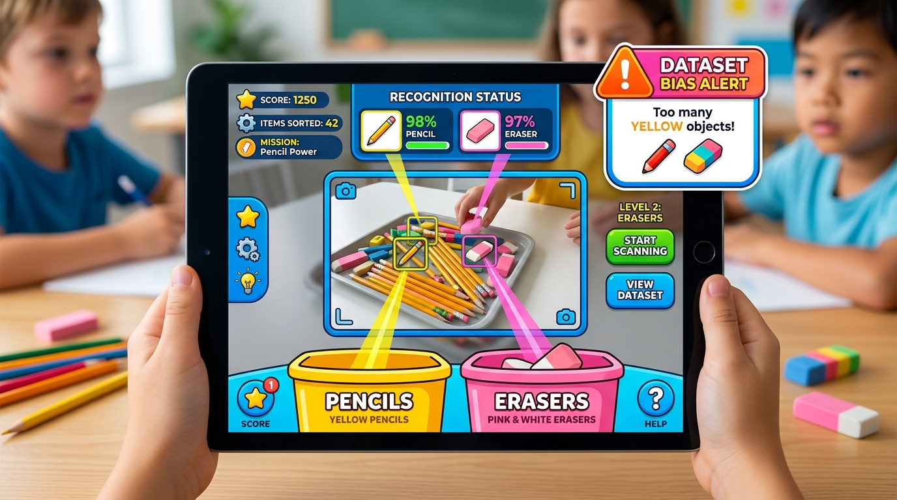
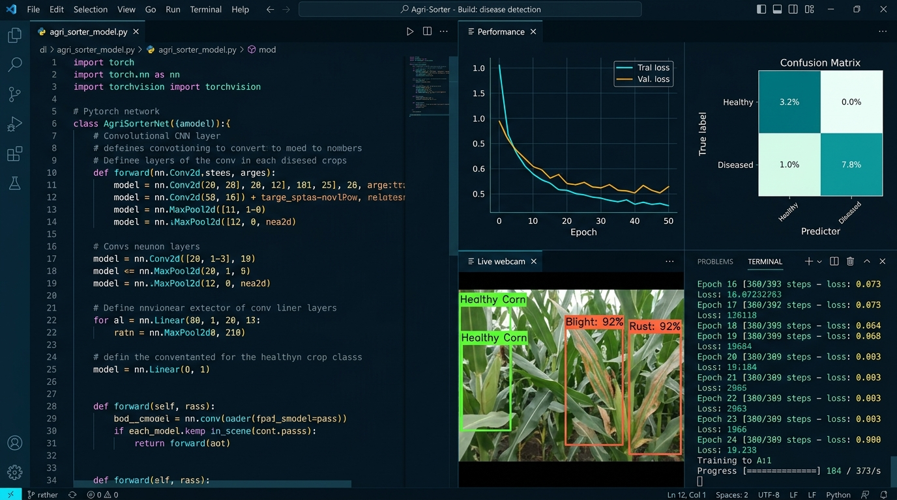
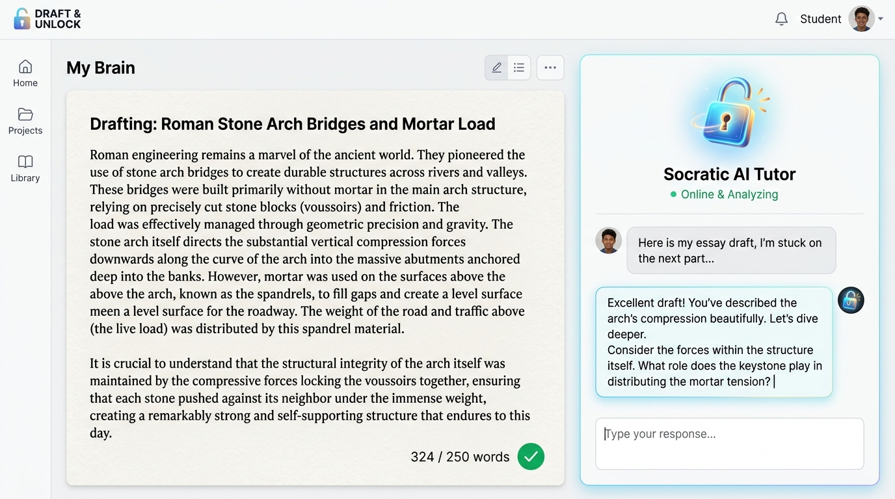
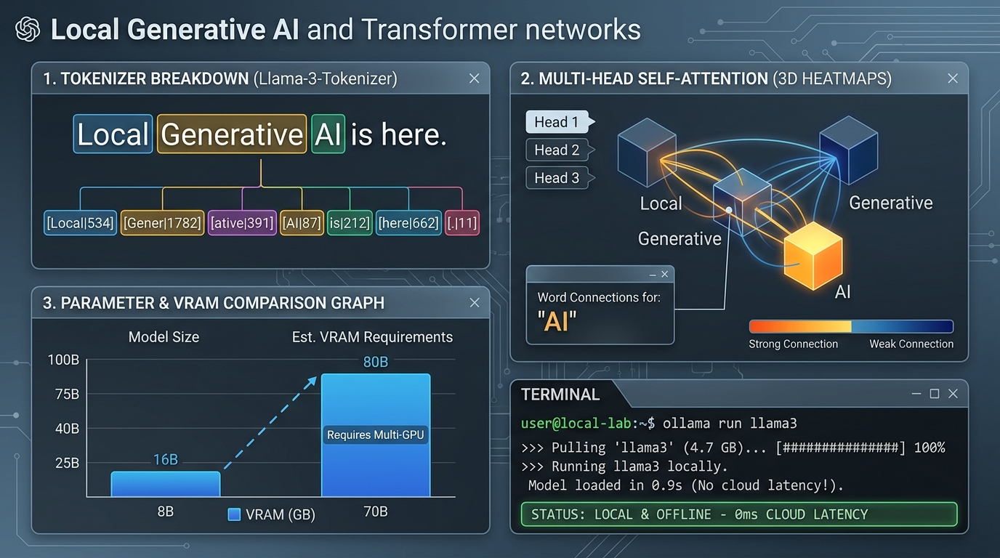

# learningAI — Zero-Cost K-12 AI Education Platform

[](#zero-cost-architecture)
[](#technical-architecture)
[](#privacy--compliance)
[](#pwa--offline-support)

**`learningAI`** is an all-in-one, privacy-first, zero-cost Progressive Web Application (PWA) and curriculum platform engineered to demystify artificial intelligence for every age: a shared AI Literacy Core for everyone, plus hands-on labs for students from kindergarten through 12th grade (ages 6 to 18).

---

## 🌟 Visual Showcase & Keyframe Assets

| The Primary Sandbox (Ages 6–11) | The Innovation Studio (Ages 12–18) |
| :---: | :---: |
|  |  |
| *Mascot Chip, Live Teachable Machine & Dataset Bias Alert* | *VS Code-style dark IDE, Pyodide Python & Agri-Sorter CNN* |

| Socratic Split-Screen (Co-Pilot) | Transformer & Local LLM Capstone |
| :---: | :---: |
|  |  |
| *Draft & Unlock workspace with Padlock Gatekeeper* | *BPE Tokenizer, Self-Attention & Offline Ollama Guide* |

---

## 💡 The Zero Financial Cost Guarantee

Educational institutions and school districts cannot afford multi-thousand dollar monthly cloud computing bills or per-token LLM API fees. `learningAI` is engineered specifically to eliminate all ongoing server costs:

1. **In-Browser Python Compute (Pyodide WebAssembly):**
   - Runs full Python 3.11 with NumPy and Pandas directly inside the student's browser sandbox via WebAssembly.
   - **Cost to developer/district:** **\$0.00** (Zero cloud servers, zero AWS/GCP bills).
2. **On-Device Computer Vision (TensorFlow.js):**
   - Real-time webcam feeds are processed client-side via WebGL.
   - Images never leave the student's machine, satisfying stringent COPPA and FERPA student data privacy laws.
   - **Cost to developer/district:** **\$0.00**.
3. **Sovereign Local Large Language Models (Ollama & LM Studio):**
   - High school capstone guides students to download free, open-source model weights (e.g., Llama 3 8B, Mistral, Qwen) and run them locally offline.
   - **Cost to developer/district:** **\$0.00**.
4. **Zero-Cost Neural Audio & Video Generation:**
   - Platform audio voiceovers and subtitles are produced using Microsoft Edge-TTS neural speech or native macOS speech synthesis (`say` + `afconvert`), requiring zero paid API subscriptions.
   - **Cost to developer/district:** **\$0.00**.

---

## 🏛️ Curriculum Structure & Platform Blueprint

The curriculum follows a coordinated, all-ages progression (Understand → Apply → Create): one shared AI literacy foundation for everyone, then age- and role-specific pathways into hands-on labs and projects. This mirrors the structure of China's national AI education push (common literacy for every stage, applied practice, advanced talent tracks, trained instructors, lifelong learning) while deliberately leaving out classroom surveillance and political-conformity requirements.

### Section 0: AI Literacy Core (All Ages)
*Goal: Every learner, child to grandparent, can understand AI, direct it, check its work, protect information, and keep people in charge.*

Seven interactive lessons, each ending with a no-hints, no-AI transfer check. A lesson only counts once the learner passes that check on their own.

1. **What counts as AI?** Sort everyday tools into ordinary software, machine learning, and generative AI; training vs. inference; fluent is not the same as true.
2. **Can a fluent answer be wrong?** Check a polished AI answer against an official source, catching a wrong fact, an arithmetic error, and an invented citation.
3. **Privacy before prompting:** Redact a fictional sign-up form down to only what the task needs.
4. **Spot the hidden instruction:** Find a prompt-injection attack hidden in a document and respond safely.
5. **Is that really your grandson?** Build a verification plan for an AI voice-clone scam.
6. **Draft-only helper:** Set Allow / Ask a human / Block permissions for an AI agent.
7. **Who decides?** Match situations to the right level of human and expert oversight, including the right to challenge AI decisions.

Also included: learning pathways for young children, middle school, high school, adults and job seekers, older adults and families, and teachers and managers, plus a skills record with practice badges (AI-aware citizen, Responsible AI user). Progress is stored only in the learner's browser.

### Section 1: The Primary Sandbox (Ages 6–11)
*Goal: Strip the "magic" away. AI isn't a robot brain; it's math, data, and pattern matching.*

* **3rd Grade — Pattern Recognition & Teachable Machine:**
  - In-browser camera integration: students collect samples of pencils vs. erasers and inspect real-time classification confidence bars.
  - **Dataset Bias Alert:** Interactive simulation where training only on yellow pencils causes an immediate 90%+ failure on blue pencils, visually teaching students why diverse datasets are critical.
* **4th Grade — Computational Logic & Structures:**
  - Integrated Blockly-inspired visual coding interface.
  - Students snap together `When Start`, `Move Forward`, `Turn Left/Right`, `If Obstacle Ahead`, and `Loop Until Star` blocks to guide an autonomous rover through maze grids.
* **5th Grade — Intelligent Agents & Autonomy:**
  - 2D Virtual Robot Hardware Sandbox with real-time LIDAR raycasting.
  - Illustrates the foundational robotics control loop: `Input (LIDAR sensors)` $\to$ `Processing (Obstacle avoidance algorithm)` $\to$ `Output (Left/Right wheel motors)`.
  - Students can click anywhere on the canvas to place custom obstacle blocks and observe reactive avoidance.

---

### Section 2: The Innovation Studio (Ages 12–18)
*Goal: Transition into practical Python application, hardware, and open-source local AI deployment.*

* **VS Code-Style Dual-Pane IDE:**
  - Left pane: Multi-file Python code editor with syntax indentation and file tabs.
  - Right pane: Live data visualization, terminal console, and interactive lab output.
* **Ages 12–14 — Data Analysis & Machine Learning ("The Agri-Sorter"):**
  - In-app Python script training a CNN to classify agricultural produce leaves (Healthy Corn, Common Rust, Northern Leaf Blight).
  - Displays real-time confusion matrices, loss curves, and diagnostic remedy recommendations.
* **Ages 14–16 — Smart Hardware & IoT Home:**
  - Python scripts controlling virtual smart home states (Lights, Thermostat, Automated Blinds).
  - Native Web Speech API integration: students speak voice commands into their microphone and inspect real-time speech-to-text token streams and intent parsing.
* **Ages 14–17 — AI Ethics & State Alignment:**
  - Algorithmic fairness parity audits checking demographic false positive rates against the 80% legal standard.
  - Interactive Autonomous Vehicle Dilemma (Trolley Problem algorithm).
* **Ages 16–18 — NEW CAPSTONE: Generative AI & Local Models:**
  - **Live BPE Tokenizer:** Type any phrase to watch text split into color-coded tokens with integer IDs.
  - **Self-Attention Visualizer:** Relational arc graph demonstrating multi-head self-attention connections.
  - **Parameters & VRAM Calculator:** Select 1B to 70B parameters and 4-bit vs. 16-bit quantization to compute exact VRAM requirements.
  - **Offline Ollama Launcher:** Step-by-step tutorial to download HuggingFace models, launch `ollama run llama3`, and live-ping `http://localhost:11434`.

---

### Section 3: Non-Tech Subjects — The Socratic Split-Screen
*Goal: Meta-cognition, prompt engineering, and thinking alongside AI without outsourcing human intellect.*

* **The "Draft & Unlock" Two-Step Rule:**
  - **Left Pane ("My Brain"):** Distraction-free student text editor with real-time word counter and progress meter.
  - **Padlock Gatekeeper:** The Socratic AI Assistant on the right is locked behind an animated padlock and dimmed out until the student drafts at least 200 words of authentic human thought.
  - **Strict Pedagogical System Prompt:** The AI is strictly forbidden from writing essays or providing direct answers. Instead, it questions structural assumptions, identifies missing evidence, and probes for blind spots (e.g., examining mortar load and voussoir compression in Roman stone arch bridges).

---

## 🎬 Cinematic Video Theater & Production Suite

The app includes an embedded 4K Cinematic Video Theater with synchronized narration audio and WebVTT subtitles:

1. **Platform Overview:** Demystifying Intelligence for Every Student
2. **The Sandbox:** Pattern Recognition, Logic & Autonomous Agents
3. **The Innovation Studio:** Real-World Python, Machine Learning & Smart Hardware
4. **Capstone Lab:** Generative AI, Transformers & Local Offline Models
5. **The Socratic Split-Screen:** The Draft & Unlock Workspace

### Generating Voiceovers
To re-generate voiceover audio tracks and subtitles offline at \$0.00 cost:
```bash
python3 video_assets/generate_voiceovers.py
```
*(Uses native macOS `say` + `afconvert` offline, or Microsoft Edge-TTS when network is present).*

---

## 🚀 Running the App Locally

Because `learningAI` is 100% static and client-side, running it requires no database configuration or complex backend setup:

### Option 1: Simple Local Server
```bash
cd learningAI
python3 -m http.server 8000
```
Open [http://localhost:8000](http://localhost:8000) in your web browser.

### Option 2: GitHub Pages (Free Hosting)
Push this directory to a GitHub repository and enable GitHub Pages in Settings $\to$ Pages. It will deploy instantly with zero hosting fees.
